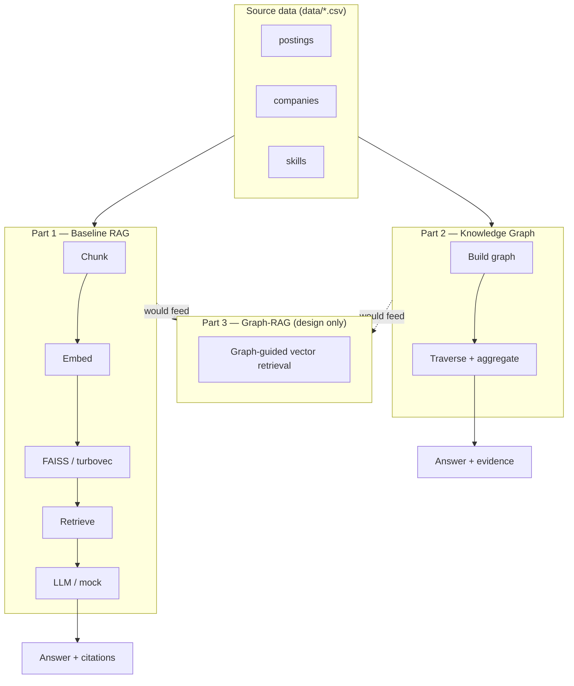
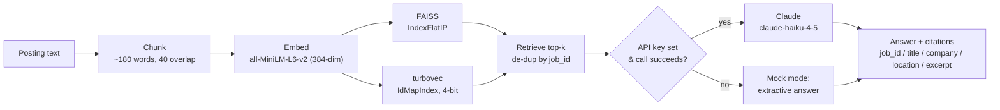
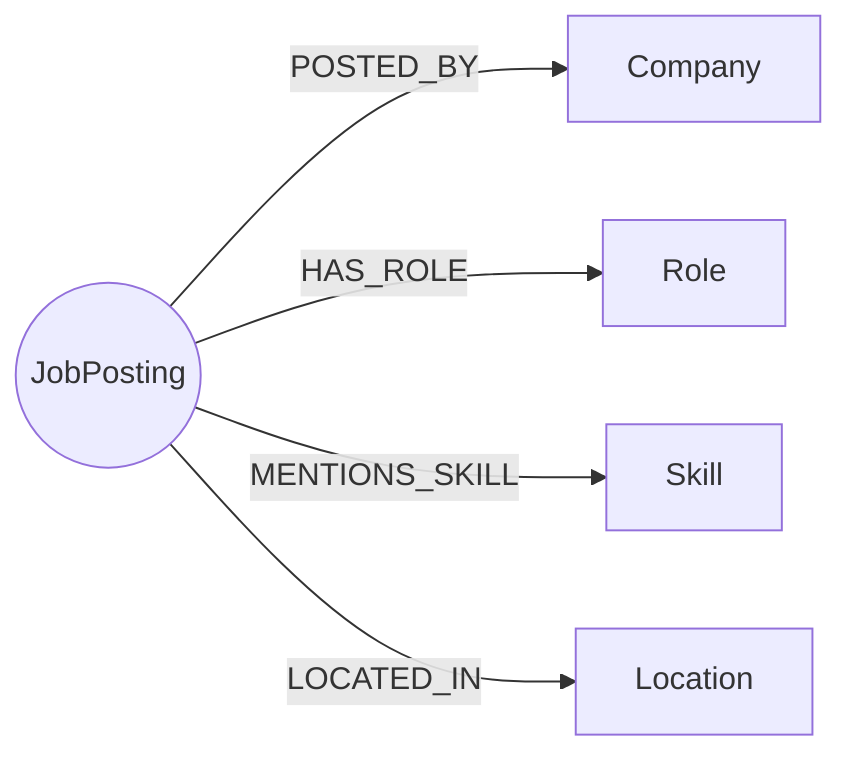
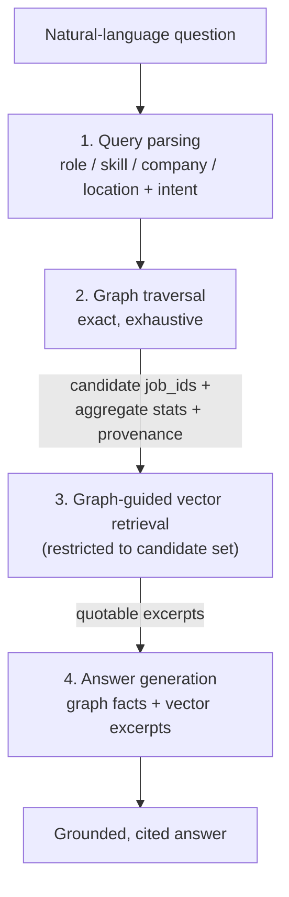

<!--
Job-Market Intelligence Assistant — presentation deck
Format: plain Markdown, `---` = slide break, fenced ```mermaid``` blocks for diagrams.
Renders in Slidev, reveal-md, Docusaurus, Obsidian, VS Code (with a mermaid/markdown-preview extension),
and GitHub's own markdown viewer (which renders mermaid natively). No framework-specific frontmatter used,
so pick whichever renderer you prefer.
Target: ~15 minutes, ~17 slides (~50s/slide average — title/agenda/closing go fast, merge slides 6+7 or
9+10 if you need to reclaim time). Each slide has a short "Speaker notes" line with the talking point.
-->

# Job-Market Intelligence Assistant

### RAG + Knowledge Graph over job-posting data

> **Important Remark**

>This work was done using Visual Code with Copilot mainly in ask mode. Parts of the code were done in this way. For example, in implementing the networkx code, which is a framework that I did not know before.

>Agent mode was used to produce documentation, including this README.md and the presentation.md file.

>The code architecture for the jobmarket package plus the API were done following my typical 'boilerplate code' for this kind of projects. Although the code architecture is based in production ready applications, the version presented here is incomplete, as such, not ready for production.

>Some alternative approaches related with parts of the RAG process, for example, a different embeddings strategy or the use of turbovec, are based on developments I have done for other projects.

>A critical analysis and review was done by me, although not exhaustive.

---

## Agenda

1. Problem & objective
2. Data at a glance
3. System architecture
4. Part 1 — Baseline RAG
5. Part 2 — Knowledge Graph
6. Part 3 — Graph-RAG design
7. Trade-offs & next steps

---

## Problem & objective

Build a prototype that answers natural-language questions like:

- *"Which skills distinguish Machine Learning Engineer roles from Data Scientist roles?"*
- *"Which companies hire for both data engineering and ML engineering roles, and what skills connect them?"*
- *"Given Python, SQL, Docker, and NLP experience, what adjacent roles are relevant?"*

**Required components:**

| # | Component | Deliverable |
|---|---|---|
| 1 | Baseline RAG | Working implementation |
| 2 | Knowledge Graph | Working implementation |
| 3 | Graph-RAG | Architectural design |

> **Notes:** Answers need to be grounded in the source data with traceable evidence — not free-form
> LLM generation. That constraint shapes every design decision that follows.

---

## Data at a glance

| File | Rows | What it gives us |
|---|---:|---|
| `sample_postings.csv` | 4,072 | title, description, company, location, salary, experience level |
| `sample_companies.csv` | 1,979 | name, size, city/state/country, url |
| `sample_skills.csv` | 6,800 | job_id → skill_abr (**coarse** categories: `IT`, `ENG`, `ANLS`…) |
| `sample_skill_lookup.csv` | 35 | abbreviation → full name |
| `sample_industries.csv` | 422 | industry_id → industry_name |

**Two data-quality issues that impacted the design:**
- `company_id` is frequently missing → can't always join postings ↔ companies structurally.
- `sample_skills.csv` categories are too coarse for skill-level questions — fine-grained skills
  (Python, Docker, LLM…) have to be *extracted from free text*, not read from a column.

> **Notes:** These two issues directly motivate the company-keying and skill-extraction decisions
> shown later.

---

## System architecture



> **Notes:** Parts 1 and 2 are independent, working implementations against the same source data.
> Part 3 is a design for how they'd combine (not implemented).

---

## Part 1 — Baseline RAG: pipeline



> **Notes:** Two vector backends run side by side purely to compare exact vs. quantized search at
> this scale — more on that next slide. The mock-mode branch is what makes the whole notebook runnable with
> zero API keys.

---

## Part 1 — Key decisions

- **Embeddings run 100% locally** (`sentence-transformers`) — no API key needed to build the index at all.
- **Two vector stores, one interface** — FAISS (exact) *and* turbovec (4-bit quantized), to validate the
  quantized path retrieves the same top results before it's actually needed at scale.
- **Mock-mode fallback** on any LLM failure (no key, network error, rate limit) — satisfies the assignment's
  "degrade gracefully" requirement; this demo itself ran without a key.
- **Citations are structural, not just a quote** — every answer returns `job_id`, title, company, location,
  and excerpt, so a reviewer can verify the source posting directly.

> **Notes:** The FAISS-vs-turbovec comparison in the notebook shows near-identical top-5 results and
> scores — validates the quantized index without yet needing its main benefit (memory at scale).

> A typical split-chunk strategy based in a fixed size is implemented in split_into_chunks. A slighthly improved version that considers sentence-aware boundaries is implemented in improved_split_into_chunks.

> On the retrieval side it was used vector search (by similarity) plus sorted by score. An improvement can be to use an Hybrid search through an EnsembleRetriever (BM25Retriever + Vector Search Retriever)  

---

## Part 1 — Demo

**Q1:** *"Which postings mention retrieval-augmented generation, vector databases, or LLM application development?"*

Top result: **LLM Data Scientist** @ SS&C Technologies (Boston, MA)
> *"...Large Language Model (LLM) Expertise: Leverage your expertise in working with large language models" and advanced NLP model development..."*

Citations:

  [1] job_id=3904938734 | LLM Data Scientist | SS&C Technologies | Boston, MA | score=0.465
      "scope of work includes Forecast, Prediction Models, Outlier Reporting, Risk Analysis, Document classification, Data Extraction, Adhoc analysis.Implementation of..."

  [2] job_id=3904389721 | Sr. Software Engineer, Search Relevance | Moveworks | Mountain View, CA | score=0.462
      "We are looking for a sr. search relevance engineer to work with a team to improve a search based question answering platform. At Moveworks, we build search tech..."

  [3] job_id=3905287203 | Senior Machine Learning Engineer | GeneDx | United States | score=0.453
      "advanced NLP techniques such as named entity recognition, sentiment analysis, and text summarization to enhance report generationContinuously monitor, analyze,..."

  [4] job_id=3905875688 | Data Scientist | hackajob | McLean, VA | score=0.451
      "contribute to formulating recommendations for enhancing engineering solutions. Key Responsibilities Develop and train Large Language Models (LLMs) to support th..."

  [5] job_id=3905875652 | Data Scientist | hackajob | McLean, VA | score=0.451
      "contribute to formulating recommendations for enhancing engineering solutions. Key Responsibilities Develop and train Large Language Models (LLMs) to support th..."


**Q2:** *"Which skills distinguish Machine Learning Engineer roles from Data Scientist roles?"*

Top result: **LLM Data Scientist** @ SS&C Technologies (Boston, MA) — score 0.465
> *"...Large Language Model (LLM) Expertise: Leverage your expertise in working with large language models" and advanced NLP model development..."*

Found purely by semantic similarity, no keyword list required.

> **Notes:** This is the "direct retrieval" demo type — open-ended, no fixed taxonomy. Note this ran in mock mode in this environment (no API key) — the citations and
> retrieval quality are unaffected either way.

---

## Part 2 — Knowledge Graph: schema



Built with **NetworkX** — no server, easy to inspect in-notebook, more than sufficient at this scale.

**Not implemented:** `Industry` (no reliable join key in this sample), `Occupation`/ESCO enrichment
(optional, out of scope), `Skill–RELATED_TO–Skill` (not needed for the target questions).

> **Notes:** Deliberately small schema — four node types, four edge types, chosen because they
> directly answer the target question set, not because the suggested schema had more options.

---

## Part 2 — Key decisions

- **`Role`** derived from `title` via an ordered keyword taxonomy (~10 canonical roles, most-specific wins) —
  not the raw, messy title strings.
- **`Skill`** extracted from posting text via a curated ~50-term vocabulary with symbol-aware regex
  (handles `C++`, `CI/CD`, `Node.js`) — *not* `sample_skills.csv`'s coarse categories.
- **`Company`** keyed by normalized name, not `company_id` — trades perfect de-dup for actually connecting
  most postings to a company node (due to the fact of having the same company with different company_ids).
- **Bug caught during testing:** postings with a missing company name instead of being merged into one fake
  "Unknown company" node, fabricating a false bridging-company result, were dropped.


---

## Part 2 — Demo: the required KG question

**Q:** *"Which companies hire for both data engineering and ML engineering roles, and what skills connect them?"*

Answered by **traversal + set intersection** — no query language needed at this scale:

- `Data Engineer` postings appear at **253** companies; `Machine Learning Engineer` at **99**.
- **12 companies** post both: Capital One, TikTok, Akkodis, Booz Allen Hamilton, Dice, Harnham,
  ChabezTech, McKesson, Motion Recruitment, NLB Services, Orbit Recruitment Group, Mainz Brady Group.
- Skills connecting the two role types overall: **Python, SQL, AWS, Machine Learning, Azure, Spark, ETL,
  Agile, Java, Data Warehousing**.

Every result carries the exact `job_id`s that justify it — fully traceable back to source postings.

> **Notes:** Graph size for reference: 6,757 nodes / 33,351 edges built from all 4,072 postings.
> This is an exhaustive computation over the whole corpus, not a sample — the key advantage over pure vector
> search, which the next section makes explicit.

---

## Part 3 — Where RAG-only falls short

Evidence from Part 1's own demos, not hypothetical:

- **"Given Python, SQL, Docker, NLP — what adjacent roles?"** — RAG surfaced a *Mainframe/SQL/ETL* posting
  as a top match. Vector similarity matched on keyword overlap, with no notion of "how close is this role,
  structurally, to my skill profile."
- **"Which skills distinguish ML Engineer from Data Scientist?"** — RAG returned 5 relevant chunks, but a
  genuine *difference* needs a comparison over two full frequency distributions, not a handful of excerpts.
- **Vector top-k is a sample** (k≈5–8 of 16,378 chunks). Exhaustive questions — "which companies do X *and*
  Y," "what fraction mention Z" — can't be answered correctly by sampling, regardless of embedding quality.

> **Speaker notes:** This slide is the pitch for why Graph-RAG matters — not abstract, these are real
> weaknesses observed in this project's own demo output.

---

## Part 3 — Proposed architecture



- **Graph step** contributes what vector search structurally cannot: exhaustive counts, set
  intersection/difference, co-occurrence, canonicalized entities, traversal provenance.
- **Vector step** stays for what the graph can't do: free-text semantic matching and quotable excerpts.

> **Speaker notes:** This is the "not implemented" deliverable — an architecture, not code. Stage 3 reuses
> the `turbovec` allowlist-search pattern already documented in Part 1 — narrow candidates first via the
> graph, then rank by embedding similarity only within that set.

---

## Part 3 — Concrete example

**"Given Python, SQL, Docker, NLP — what adjacent roles, and what's missing?"**

Graph-aware fix for the Mainframe/SQL/ETL false positive seen earlier:

1. Build input skill set `{Python, SQL, Docker, NLP}`.
2. For every `Role`, compute its aggregate skill profile (`skills_for_role`) and rank by overlap
   (e.g. Jaccard) with the input — `Machine Learning Engineer` / `Data Engineer` score highest.
3. Diff the top role's profile against the input to report what's *missing*
   (e.g. "ML Engineer also commonly requires: AWS, Kubernetes, Spark").
4. Hand the top matching postings to vector retrieval for a quotable excerpt.

> **Speaker notes:** This directly fixes the specific failure mode shown two slides ago — worth pointing
> back at that slide for contrast.

---

## Trade-offs & limitations

- **Keyword/regex extraction**, not NER or an LLM call — fast, transparent, auditable; accepts some
  false positive/negative risk on ambiguous short tokens (documented inline in the notebook).
- **Company de-dup by normalized name** — name variants could still fragment one real company into
  multiple nodes; not resolved here.
- **Location is an unnormalized raw string** — "Boston, MA" and "Boston, Massachusetts" would be distinct
  nodes (not present in this sample, but a real risk at scale).
- **`Industry` / `Occupation` not modeled** — no reliable join key for the former in this sample; the latter
  is explicitly optional (ESCO/O*NET) and out of scope.
- **Graph-RAG is design-only** — the biggest opportunity for follow-up work.

> **Speaker notes:** Be upfront about these — they're scoped decisions, not oversights, and each is
> documented with its rationale in the notebook.

---

## Next steps

- Implement the Graph-RAG pipeline (Part 3) end-to-end.
- Company-name resolution (fuzzy matching / clustering) to reduce fragmentation.
- Expand the skill vocabulary and role taxonomy, or swap in a lightweight NER model.
- Optional ESCO/O*NET enrichment for the `Occupation` layer.
- Build a small evaluation set (golden Q&A pairs) to measure retrieval/answer quality objectively.

> **Speaker notes:** Prioritize by what a real DS/ML team would actually feel the absence of first — likely
> Graph-RAG implementation and an eval harness.

---

## Thank you

**Questions / discussion**

- Notebook: `mleng_take_home_task.ipynb`
- Setup & design note: `README.md`

> **Speaker notes:** Open the floor. Have the notebook open and ready to re-run a live query if asked.
